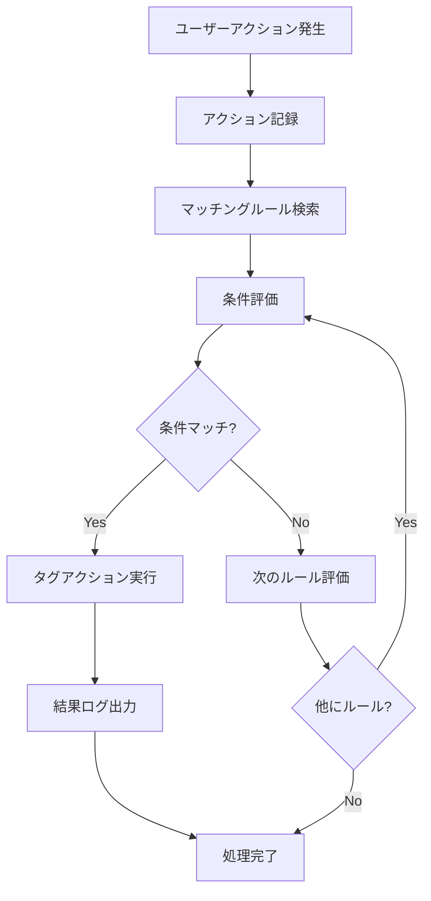

# アクション追跡システム - 実装仕様書

## 🎯 概要

LINE マーケティング自動化プラットフォームに、ユーザーアクションに基づく自動タグ付与システムを実装しました。URLクリック、ボタンクリック、返信など、様々なアクションに対してルールベースでタグを自動付与できる汎用性の高いシステムです。

## 🚀 主要機能

### 1. アクション追跡システム
- **対応アクション種別**:
  - URLクリック (URL_CLICK)
  - ボタンクリック (BUTTON_CLICK)
  - 画像クリック (IMAGE_CLICK)
  - 返信 (REPLY)
  - ポストバック (POSTBACK)
  - リアクション (REACTION)
  - メッセージシェア (MESSAGE_SHARE)
  - 位置情報シェア (LOCATION_SHARE)
  - 連絡先シェア (CONTACT_SHARE)
  - カスタム (CUSTOM)

### 2. 条件ベースのルール設定
- **条件演算子**:
  - `equals`: 完全一致
  - `contains`: 含む
  - `starts_with`: 前方一致
  - `ends_with`: 後方一致
  - `regex`: 正規表現
  - `any`: すべて

### 3. 自動実行アクション
- **タグ操作**:
  - タグ追加 (ADD_TAG)
  - タグ削除 (REMOVE_TAG)
  - ステータス変更 (SET_STATUS)

- **条件付き実行**:
  - 特定タグ保有時のみ実行
  - 特定タグ非保有時のみ実行
  - 特定ステータス時のみ実行

## 📁 ファイル構成

```
src/
├── types/index.ts              # 型定義（UserAction, ActionRule, TagAction）
├── services/ActionProcessor.ts # アクション処理エンジン
├── components/ActionRules/
│   ├── ActionRuleManager.tsx   # ルール管理画面
│   └── ActionRuleEditor.tsx    # ルール作成/編集画面
└── app/page.tsx               # メインアプリ統合
```

## 🛠 技術仕様

### データモデル

#### UserAction
```typescript
interface UserAction {
  id: string
  userId: string
  templateId: string
  deliveryLogId: string
  actionType: ActionType
  actionValue: string        // URL、ボタンテキスト、ポストバックデータなど
  metadata?: Record<string, any>  // 追加データ（座標、カスタムフィールドなど）
  timestamp: Date
  processed: boolean
}
```

#### ActionRule
```typescript
interface ActionRule {
  id: string
  templateId?: string        // 特定テンプレートのみ対象（null=全体）
  scenarioId?: string        // 特定シナリオのみ対象（null=全体）
  packId?: string           // 特定パックのみ対象（null=全体）
  actionType: ActionType
  actionCondition: {
    operator: 'equals' | 'contains' | 'starts_with' | 'ends_with' | 'regex' | 'any'
    value: string
    regex: string
  }
  tagActions: TagAction[]
  isActive: boolean
  priority: number          // 高い数値 = 高優先度
  description?: string
  createdAt: Date
  updatedAt: Date
}
```

#### TagAction
```typescript
interface TagAction {
  type: 'ADD_TAG' | 'REMOVE_TAG' | 'SET_STATUS'
  tagId?: string
  statusId?: string
  condition?: {
    ifHasTag?: string[]      // 必要タグ条件
    ifNotHasTag?: string[]   // 除外タグ条件
    ifStatus?: string        // ステータス条件
  }
}
```

## 📊 実装例

### 1. 商品ページ閲覧者にVIPタグ付与
```javascript
{
  description: '商品ページURL閲覧者にVIPタグ付与',
  actionType: 'URL_CLICK',
  actionCondition: {
    operator: 'contains',
    value: 'shop.example.com/product',
    regex: ''
  },
  tagActions: [
    {
      type: 'ADD_TAG',
      tagId: 'vip-tag-id'
    }
  ],
  priority: 10,
  isActive: true
}
```

### 2. お問い合わせボタンクリック者をリードに変更
```javascript
{
  description: 'お問い合わせボタンクリック者にリード変更',
  actionType: 'BUTTON_CLICK',
  actionCondition: {
    operator: 'equals',
    value: 'お問い合わせ',
    regex: ''
  },
  tagActions: [
    {
      type: 'SET_STATUS',
      statusId: 'lead-status-id'
    }
  ],
  priority: 8,
  isActive: true
}
```

### 3. アンケート返信者に条件付きタグ付与
```javascript
{
  description: 'アンケート返信者に特別タグ付与',
  actionType: 'REPLY',
  actionCondition: {
    operator: 'any',
    value: '',
    regex: ''
  },
  tagActions: [
    {
      type: 'ADD_TAG',
      tagId: 'active-tag-id',
      condition: {
        ifNotHasTag: ['vip-tag-id']  // VIPタグを持っていない場合のみ
      }
    }
  ],
  templateId: 'survey-template-id',  // アンケートテンプレートのみ対象
  priority: 5,
  isActive: true
}
```

## 🔧 ActionProcessor サービス

### 基本的な使用方法

```typescript
import { ActionProcessor } from '@/services/ActionProcessor'

// プロセッサーインスタンス作成
const processor = new ActionProcessor(actionRules, users, tags, statuses)

// アクション処理
const result = await processor.processAction(userAction)

console.log(result)
// {
//   userId: "user123",
//   appliedRules: ["rule1", "rule2"],
//   addedTags: ["VIP", "アクティブ"],
//   removedTags: [],
//   statusChanges: ["リード"],
//   errors: []
// }
```

### Webhook連携

```typescript
// LINE Webhookからアクション生成
const userAction = ActionProcessor.createUserActionFromWebhook(webhookData)

// URLクリック追跡
const trackingUrl = ActionProcessor.generateTrackingUrl(
  'https://shop.example.com/product/123',
  'user123',
  'template456'
)

// クリック追跡からアクション生成
const clickAction = ActionProcessor.createClickActionFromTracking({
  userId: 'user123',
  templateId: 'template456',
  originalUrl: 'https://shop.example.com/product/123',
  userAgent: 'Mozilla/5.0...',
  ip: '192.168.1.1'
})
```

## 🎨 UI コンポーネント

### ActionRuleManager
- ルール一覧表示
- フィルタリング（有効/無効/全て）
- 検索機能
- ルールの有効/無効切り替え
- 優先度表示

### ActionRuleEditor
- 基本設定（ルール名、優先度、有効/無効）
- アクション設定（種別、条件）
- 実行アクション設定（複数設定可能）
- 適用範囲設定（シナリオ/テンプレート限定）
- バリデーション機能

## 📈 導入効果

1. **自動化の向上**: 手動タグ付与からの脱却
2. **リアルタイム対応**: ユーザーアクション即座の反映
3. **精密なセグメンテーション**: 行動ベースの詳細分析
4. **運用効率化**: ルールベースの一元管理
5. **拡張性**: 新しいアクション種別への対応容易

## 🔄 処理フロー



## 🚨 注意事項

1. **優先度管理**: 高い数値ほど優先実行
2. **重複実行防止**: 同一アクションに対する重複処理制御
3. **エラーハンドリング**: 個別ルール失敗時の継続処理
4. **パフォーマンス**: 大量ルール時の処理最適化
5. **セキュリティ**: 正規表現インジェクション対策

## 📝 今後の拡張予定

- [ ] スケジュール実行（時間遅延）
- [ ] 複合条件（AND/OR組み合わせ）
- [ ] 外部API連携アクション
- [ ] A/Bテスト機能
- [ ] 詳細ログ分析
- [ ] Webhook通知機能

---

**実装日**: 2024年12月
**バージョン**: v1.0.0
**ビルドサイズ**: 200KB (+14KB from base)

この実装により、LINEマーケティング自動化プラットフォームは、ユーザーの行動に基づく高度な自動化機能を提供できるようになりました。