# データフローとシステムアーキテクチャ

## システム概要図

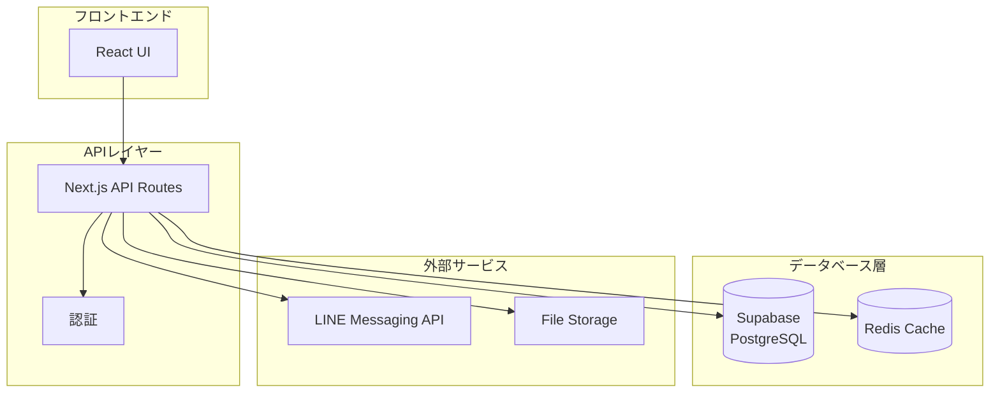

## 主要なデータフロー

### 1. ユーザー登録・管理フロー

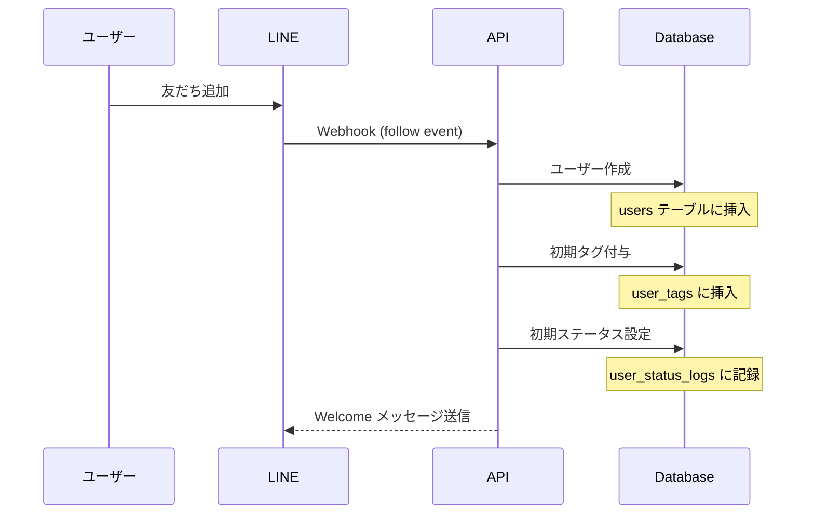

### 2. シナリオ配信フロー

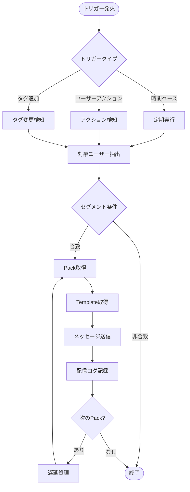

### 3. ユーザーアクション処理フロー

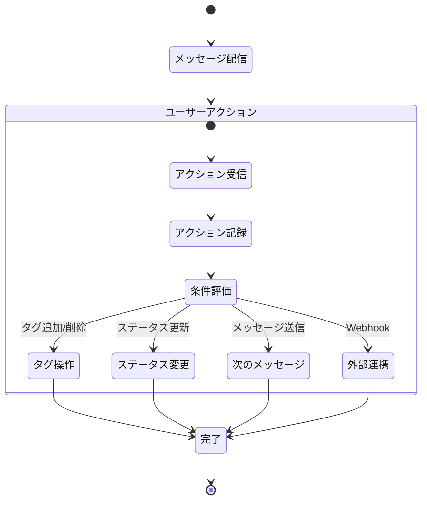

## データ整合性の保証

### トランザクション境界

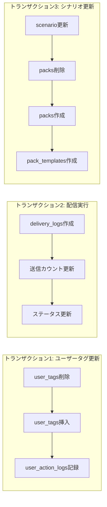

## キャッシュ戦略

### キャッシュ対象と更新タイミング

| データ種別 | キャッシュ時間 | 更新トリガー | キーパターン |
|-----------|--------------|-------------|-------------|
| ユーザー基本情報 | 1時間 | 更新時即座 | `user:{userId}` |
| タグ一覧 | 24時間 | タグ作成/更新時 | `tags:all` |
| セグメント結果 | 15分 | セグメント更新時 | `segment:{segmentId}:users` |
| テンプレート | 1時間 | テンプレート更新時 | `template:{templateId}` |
| 配信統計 | 5分 | - | `stats:delivery:{broadcastId}` |

### キャッシュ無効化フロー

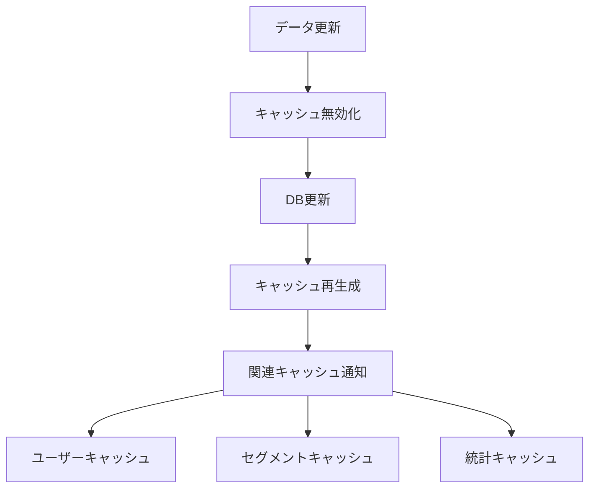

## バックグラウンドジョブ

### ジョブの種類と実行タイミング

```mermaid
gantt
    title バックグラウンドジョブスケジュール
    dateFormat HH:mm
    axisFormat %H:%M
    
    section 定期ジョブ
    セグメント再計算     :done, seg1, 00:00, 30m
    配信統計集計         :done, stat1, 00:30, 20m
    アクション処理       :active, act1, 00:00, 24h
    
    section 日次ジョブ
    データクリーンアップ  :crit, clean1, 02:00, 1h
    レポート生成         :done, report1, 03:00, 30m
    バックアップ         :done, backup1, 04:00, 2h
```

### ジョブ処理フロー

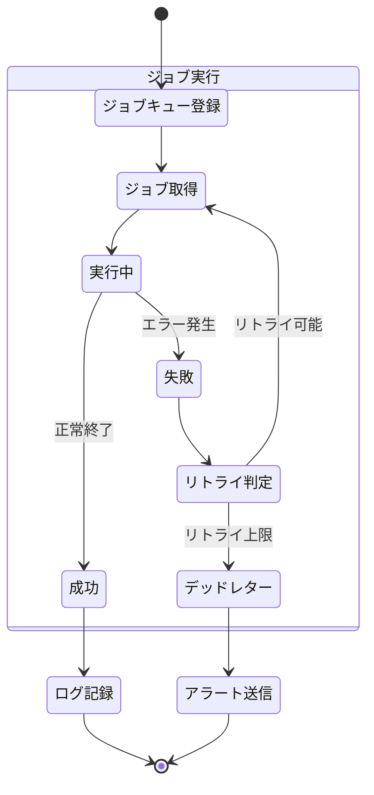

## データ分析パイプライン

### リアルタイム分析

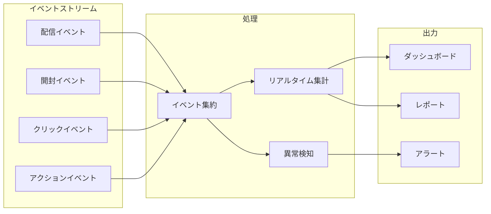

### バッチ分析

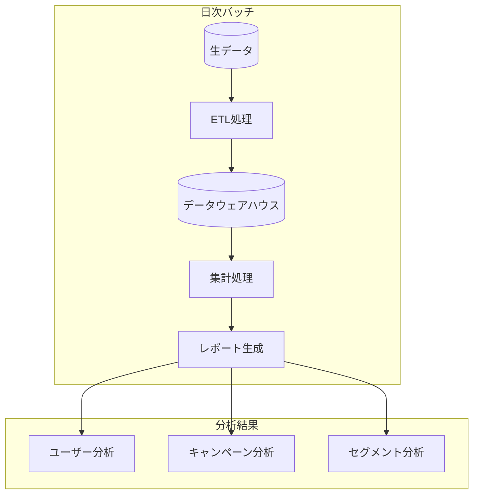

## セキュリティとアクセス制御

### データアクセス階層

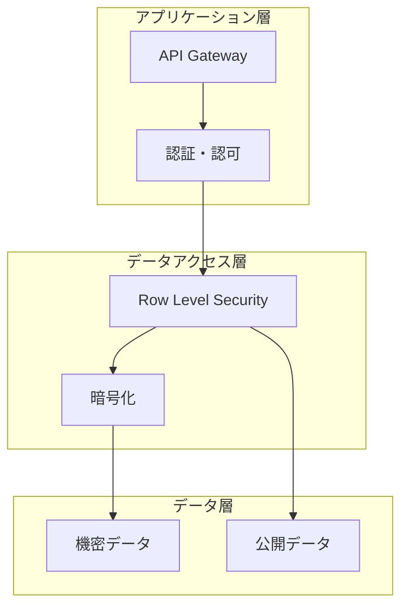

### 監査ログフロー

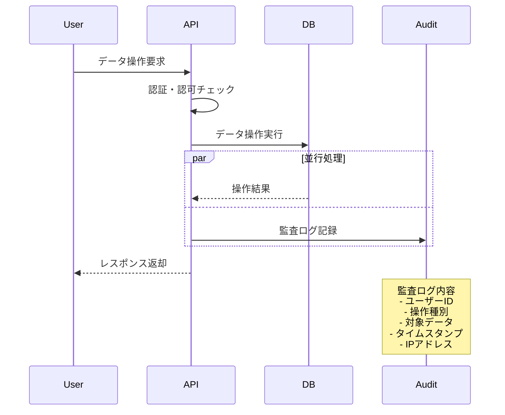

## スケーラビリティ対策

### 水平スケーリング戦略

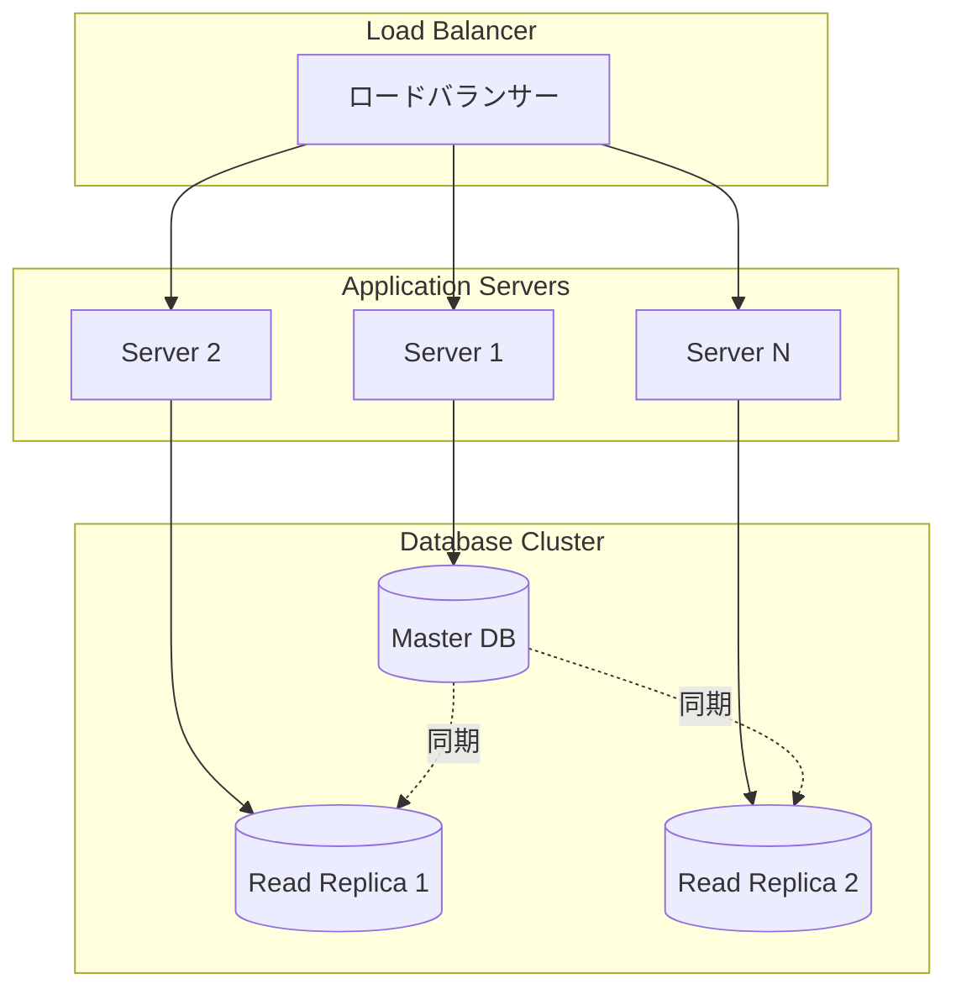

### シャーディング戦略

| テーブル | シャーディングキー | 分割方法 |
|---------|------------------|----------|
| users | userId | ハッシュ分割 |
| delivery_logs | userId + 年月 | 複合キー分割 |
| user_actions | userId | ハッシュ分割 |
| campaigns | campaignId | レンジ分割 |

## 災害復旧計画

### バックアップとリストア

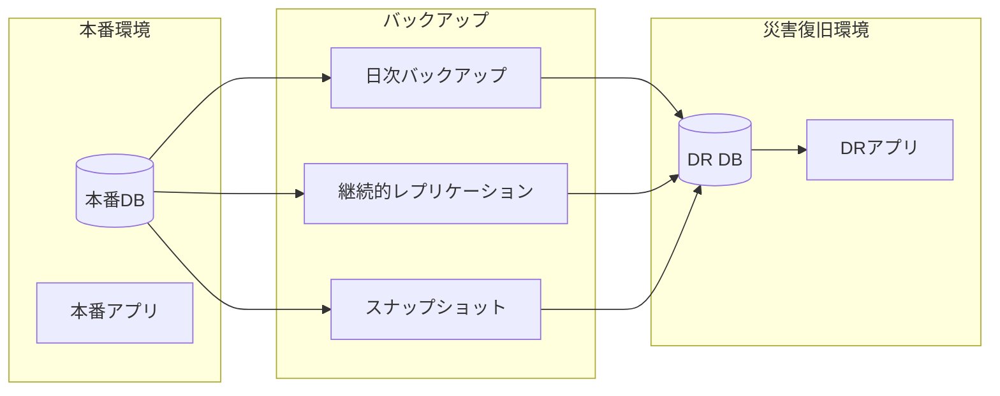

### RPO/RTO目標

- **RPO (Recovery Point Objective)**: 1時間
- **RTO (Recovery Time Objective)**: 4時間

### 復旧手順

1. 障害検知とアラート
2. 影響範囲の特定
3. DRサイトへの切り替え判断
4. DNSおよびロードバランサーの切り替え
5. データ整合性の確認
6. サービス再開とモニタリング