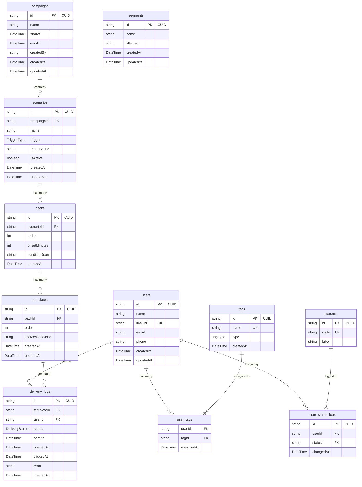
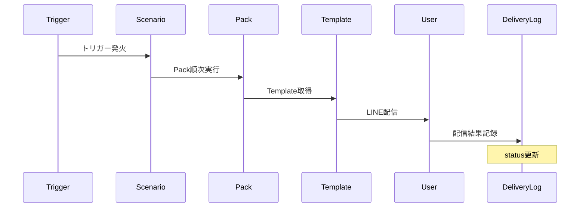

# データベースER図

## Entity Relationship Diagram (実際のPrismaスキーマ基準)



## 主要なリレーションシップの説明

### 1. ユーザー中心のリレーション
- **users ↔ tags** (多対多): user_tagsテーブルを介してユーザーにタグを割り当て
- **users → user_status_logs** (1対多): ユーザーのステータス変更履歴を記録
- **users → delivery_logs** (1対多): ユーザーへのメッセージ配信履歴

### 2. キャンペーン・配信フロー
- **campaigns → scenarios** (1対多): キャンペーン内に複数のシナリオを定義
- **scenarios → packs** (1対多): シナリオ内に複数のメッセージパックを配置
- **packs → templates** (1対多): パック内に複数のテンプレートを順序付けて配置

### 3. メッセージ配信と追跡
- **templates → delivery_logs** (1対多): テンプレートから生成される配信ログ
- ユーザーごとの配信結果を追跡

### 4. 階層構造
```
Campaign（マーケティングキャンペーン）
  └── Scenario（自動化シナリオ）
        └── Pack（メッセージバンドル）
              └── Template（個別メッセージ）
                    └── DeliveryLog（配信結果）
```

## データフローの例

### シナリオ配信のフロー


### セグメント配信のフロー
1. **Segment** でフィルター条件を定義（JSON形式）
2. フィルター条件に合致するユーザーを抽出
3. 対象ユーザーにメッセージ配信
4. 各ユーザーへの配信を **DeliveryLog** に記録

## Enum定義

### TagType
```
MANUAL      - 手動設定タグ
AUTOMATIC   - 自動設定タグ
BEHAVIORAL  - 行動ベースタグ
```

### TriggerType
```
MANUAL          - 手動実行
SCHEDULE        - スケジュール実行
USER_ACTION     - ユーザーアクション
TAG_ADDED       - タグ追加時
STATUS_CHANGED  - ステータス変更時
TIME_BASED      - 時間ベース
```

### DeliveryStatus
```
PENDING    - 送信待ち
SENT       - 送信済み
DELIVERED  - 配信済み
OPENED     - 開封済み
CLICKED    - クリック済み
FAILED     - 失敗
CANCELLED  - キャンセル
```

## インデックス設計

### 推奨インデックス

```sql
-- ユーザー検索
CREATE UNIQUE INDEX idx_users_lineUid ON users(lineUid);
CREATE INDEX idx_users_created ON users(createdAt);

-- タグ検索
CREATE UNIQUE INDEX idx_tags_name ON tags(name);
CREATE INDEX idx_user_tags_user ON user_tags(userId);
CREATE INDEX idx_user_tags_tag ON user_tags(tagId);

-- ステータス
CREATE UNIQUE INDEX idx_statuses_code ON statuses(code);

-- 配信ログ
CREATE INDEX idx_delivery_logs_user ON delivery_logs(userId);
CREATE INDEX idx_delivery_logs_template ON delivery_logs(templateId);
CREATE INDEX idx_delivery_logs_status ON delivery_logs(status);
CREATE INDEX idx_delivery_logs_created ON delivery_logs(createdAt);
```

## パフォーマンス最適化のポイント

### 1. バッチ処理
- 大量配信時は delivery_logs をバルクインサート
- Prismaの `createMany` を活用

### 2. JSON フィールドの最適化
- `filterJson` (segments): 複雑なフィルター条件
- `conditionJson` (packs): 実行条件
- `lineMessageJson` (templates): LINEメッセージ定義

### 3. N+1問題の回避
```typescript
// Prismaのincludeを活用
const campaignWithScenarios = await prisma.campaign.findUnique({
  where: { id },
  include: {
    scenarios: {
      include: {
        packs: {
          include: {
            templates: true
          }
        }
      }
    }
  }
});
```

## データ整合性

### 外部キー制約（CASCADE DELETE）
- `user_tags`: ユーザーまたはタグ削除時に自動削除
- `user_status_logs`: ユーザー削除時に自動削除
- `scenarios`: キャンペーン削除時に自動削除
- `packs`: シナリオ削除時に自動削除
- `templates`: パック削除時に自動削除

### トランザクション要件
```typescript
// タグ一括更新の例
await prisma.$transaction([
  prisma.userTag.deleteMany({ where: { userId } }),
  prisma.userTag.createMany({ data: newTags })
]);
```

## 拡張性の考慮

### TypeScriptレイヤーでの拡張
実際のPrismaスキーマはシンプルに保ち、TypeScriptの型定義レイヤー(`/src/types/`)で以下を拡張：
- カスタムフィールド（ユーザー属性）
- 予約管理機能
- リマインダー機能
- 一斉配信機能
- アクションルール
- フォルダシステム

この設計により、データベーススキーマの変更を最小限に抑えながら、アプリケーション層で機能を柔軟に拡張できます。